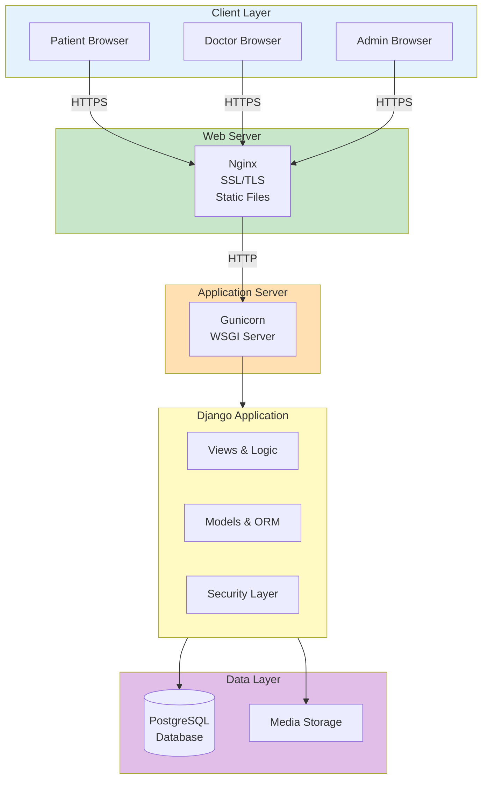

# Visual Diagram Creation Guide
## For PowerPoint/Google Slides

---

## Quick Copy-Paste Diagrams

### Diagram 1: System Architecture (Simple)

**Copy this structure into PowerPoint:**

```
┌─────────────────────────────────────────┐
│         CLIENT BROWSERS                  │
│  Patient | Doctor | Admin                │
└──────────────┬──────────────────────────┘
               │ HTTPS
               ▼
┌─────────────────────────────────────────┐
│         NGINX (Web Server)               │
│  SSL/TLS | Static Files                  │
└──────────────┬──────────────────────────┘
               │ HTTP
               ▼
┌─────────────────────────────────────────┐
│      GUNICORN (App Server)              │
└──────────────┬──────────────────────────┘
               │
               ▼
┌─────────────────────────────────────────┐
│      DJANGO APPLICATION                  │
│  • Views | Models | Security             │
└──────────────┬──────────────────────────┘
               │
    ┌──────────┴──────────┐
    ▼                      ▼
┌─────────┐          ┌─────────┐
│Database │          │  Files  │
│PostgreSQL│          │ Storage │
└─────────┘          └─────────┘
```

---

## PowerPoint/Google Slides Instructions

### Step 1: Create the Diagram

1. **Open PowerPoint/Google Slides**
2. **Insert → Shapes** (or use SmartArt)
3. **Create boxes for each component:**
   - Client Layer (Top)
   - Web Server (Middle)
   - Application Server (Middle)
   - Django Application (Middle)
   - Database & Storage (Bottom)

### Step 2: Add Components

**Layer 1: Client (Top)**
- Box: "Patient Browser"
- Box: "Doctor Browser"  
- Box: "Admin Browser"

**Layer 2: Web Server (Middle-Top)**
- Box: "Nginx"
  - Sub-text: "SSL/TLS, Static Files"

**Layer 3: Application Server (Middle)**
- Box: "Gunicorn"
  - Sub-text: "WSGI Server"

**Layer 4: Django (Middle-Bottom)**
- Box: "Django Application"
  - Sub-text: "Views | Models | Security"

**Layer 5: Data (Bottom)**
- Box: "PostgreSQL Database"
- Box: "Media Storage"

### Step 3: Add Arrows

- **Down arrows:** Show data flow from client to database
- **Label arrows:** "HTTPS", "HTTP", "ORM Queries"

### Step 4: Color Code

- **Blue:** Client layer
- **Green:** Web/App servers
- **Orange:** Application
- **Purple:** Database
- **Red borders:** Security components

---

## Mermaid Diagram (For Online Tools)

Copy this into [Mermaid Live Editor](https://mermaid.live):



---

## Draw.io XML (For diagrams.net)

1. Go to [diagrams.net](https://app.diagrams.net)
2. Create new diagram
3. Use the structure below:

**Components to Add:**
- **Top Row:** 3 boxes (Patient, Doctor, Admin browsers)
- **Second Row:** 1 box (Nginx) - wider
- **Third Row:** 1 box (Gunicorn)
- **Fourth Row:** 1 box (Django Application) - wider
- **Bottom Row:** 2 boxes (Database, Storage)

**Connections:**
- All browsers → Nginx (down arrow, label "HTTPS")
- Nginx → Gunicorn (down arrow, label "HTTP")
- Gunicorn → Django (down arrow)
- Django → Database (down arrow, label "ORM")
- Django → Storage (down arrow, label "Files")

---

## Simple Text-Based Version (For Quick Reference)

```
USER INTERFACE
    │
    │ HTTPS
    ▼
NGINX (SSL/TLS, Static Files)
    │
    │ HTTP
    ▼
GUNICORN (WSGI Server)
    │
    ▼
DJANGO (Views, Models, Security)
    │
    ├──► PostgreSQL Database
    └──► Media File Storage
```

---

## Security Architecture Diagram

**Simple Version:**

```
┌─────────────────────────────────────┐
│   TRANSPORT SECURITY                │
│   HTTPS/SSL (TLS 1.2+)              │
└──────────────┬──────────────────────┘
               │
               ▼
┌─────────────────────────────────────┐
│   AUTHENTICATION SECURITY           │
│   PBKDF2-SHA256 Password Hashing   │
│   CSRF Protection                   │
└──────────────┬──────────────────────┘
               │
               ▼
┌─────────────────────────────────────┐
│   AUTHORIZATION SECURITY            │
│   Role-Based Access Control (RBAC) │
│   Custom Mixins                     │
└─────────────────────────────────────┘
```

---

## User Role Flow Diagram

**Simple Version:**

```
        LOGIN
         │
         ▼
    AUTHENTICATION
    (PBKDF2-SHA256)
         │
    ┌────┼────┐
    │    │    │
    ▼    ▼    ▼
PATIENT DOCTOR ADMIN
    │    │    │
    ▼    ▼    ▼
Dashboard Dashboard Admin Panel
```

---

## Recommended Tools for Creating Visual Diagrams

### Free Options:
1. **Draw.io (diagrams.net)** - Best for architecture diagrams
   - URL: https://app.diagrams.net
   - Export: PNG, SVG, PDF

2. **Mermaid Live Editor** - Code-based diagrams
   - URL: https://mermaid.live
   - Export: PNG, SVG

3. **Lucidchart** - Professional (free tier available)
   - URL: https://www.lucidchart.com

4. **PowerPoint/Google Slides** - Built-in shapes
   - Use SmartArt or manual shapes

### Paid Options:
1. **Visio** - Microsoft's diagramming tool
2. **OmniGraffle** - Mac diagramming tool
3. **Creately** - Collaborative diagramming

---

## Color Scheme for Diagrams

**Recommended Colors:**
- **Client Layer:** #E3F2FD (Light Blue)
- **Web Server:** #C8E6C9 (Light Green)
- **Application:** #FFE0B2 (Light Orange)
- **Database:** #E1BEE7 (Light Purple)
- **Security:** #FFCDD2 (Light Red) with lock icons

**Text Colors:**
- **Headings:** #1976D2 (Dark Blue)
- **Body Text:** #424242 (Dark Gray)
- **Highlights:** #F57C00 (Orange)

---

## Tips for Creating Professional Diagrams

1. **Consistency:**
   - Use same shapes for same component types
   - Keep spacing uniform
   - Use consistent colors

2. **Clarity:**
   - Label all components clearly
   - Use arrows with labels
   - Add legends if needed

3. **Simplicity:**
   - Don't overcrowd
   - Focus on main components
   - Hide implementation details

4. **Visual Hierarchy:**
   - Important components larger
   - Use colors to group related items
   - Use shadows/3D for depth

5. **Export Quality:**
   - Export at high resolution (300 DPI)
   - Use PNG or SVG format
   - Test on projector before presentation

---

## Quick Checklist

- [ ] All components labeled clearly
- [ ] Arrows show data flow direction
- [ ] Colors are consistent
- [ ] Text is readable (minimum 12pt)
- [ ] Security components highlighted
- [ ] Diagram fits on one slide
- [ ] Exported at high resolution
- [ ] Tested on presentation screen

---

## Example Slide Layout

**Slide Title:** "System Architecture"

**Top Section (20%):** Title and subtitle

**Middle Section (70%):** Main diagram

**Bottom Section (10%):** Key points or legend

**Diagram Size:** Should fill 70-80% of slide
**Text Size:** Minimum 18pt for labels, 24pt for titles

